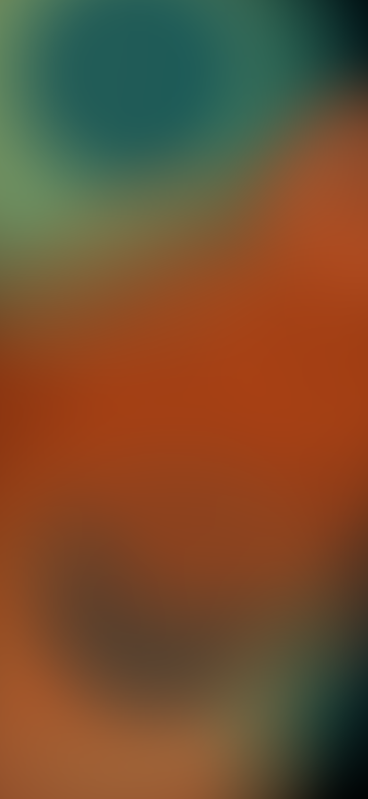

# 🟠 bokeh-lava-gradient

Animated **bokeh / lava gradient backgrounds** for Flutter — soft colored blobs
drifting under a Gaussian blur, plus a path-faithful **mesh gradient** that
cross-fades between frames. Pure Flutter, **zero dependencies**.

Built originally for the Soonr rebrand (warm orange palette), but every color,
size and motion knob is a parameter.

## ▶️ Live simulation

**https://keepyaoung.github.io/bokeh-lava-gradient/**

An interactive build of the demo app. Toggle between the **active presets** —
`OG`, `Light 2`, `Dark 3` — and watch the palette swap live while the blobs
keep drifting.

> First load may take a few seconds (Flutter web bootstrap). Resize the window
> to see the gradient stays full-bleed at any aspect ratio.

<p align="center">
  
  
  
</p>
<p align="center"><sub>active presets — <code>og</code> · <code>light2</code> · <code>dark3</code> (375×812 @2x)</sub></p>

## 🎨 Presets

```dart
BokehLavaGradient.preset(BokehTheme.dark3, child: ...);
```

All presets — ✅ active in the demo, 💤 commented out in code:

<!-- PRESETS:START -->
<!-- auto-generated by tool/update_readme.dart — do not edit by hand -->
| Preset | Active | Base | Blob colors | Opacity |
|--------|:------:|------|-------------|---------|
| `og` | ✅ | `#C65318` | `#FFE6B8` `#FFD089` `#FFB85C` `#FF9A43` `#FC7C2C` `#F26019` `#D94E10` `#FFCBA0` `#932D00` | 0.85 |
| `light1` | 💤 | `#FFF1E2` | `#FFE0C8` `#FFD3B0` `#FFC9A8` `#FFE6D6` `#FAD4B8` `#FFBE99` `#FFEAD2` | 0.60 |
| `light2` | ✅ | `#FFF8EE` | `#5E8863` `#AE5C34` `#9BBF8E` `#FFF4D8` | 0.80 |
| `light3` | 💤 | `#F7E0B6` | `#5E8863` `#1C1F16` `#AE5C34` `#9BBF8E` `#FFF4D8` | 0.60 |
| `dark1` | 💤 | `#8F2C00` | `#FFE6B8` `#FFD089` `#FFB85C` `#FF9A43` `#FC7C2C` `#F26019` `#D94E10` `#FFCBA0` `#932D00` | 0.85 |
| `dark2` | 💤 | `#160B04` | `#FF8A2A` `#FF6A14` `#FFB152` `#FFC97A` `#E2530E` `#7A2600` `#FFD089` | 0.90 |
| `dark3` | ✅ | `#000000` | `#09353C` `#64AA74` `#034753` `#C15B2E` `#B14415` `#C15B2E` `#B14415` | 0.72 |
<!-- PRESETS:END -->

💤 presets live **commented out** in
[`lib/bokeh_lava_gradient.dart`](lib/bokeh_lava_gradient.dart) — uncomment their
enum value + `_kPresets` entry to bring them back into the demo.

`bokehThemeBrightness(theme)` returns the preset's `Brightness` so you can pick
readable text/icon colors for content on top.

## ✨ What it does

| Mode | How it works |
|------|--------------|
| **`BokehLavaGradient`** | N soft radial-gradient blobs (varied size & color) bounce slowly around the canvas; the whole layer gets a Gaussian blur → bokeh. Overlapping blobs blend via alpha. |
| **`MeshGradient`** | Renders real Figma vector paths + per-shape Gaussian blur (`MaskFilter.blur`), faithful to the design. Swap `preset` to cross-fade between frames; an optional ambient drift keeps it alive. |

Both are resolution-independent (no image assets) and fill their parent.

## 🚀 Usage

```dart
import 'package:bokeh_lava_gradient/bokeh_lava_gradient.dart';

// Drop it behind your content
Stack(
  fit: StackFit.expand,
  children: [
    const BokehLavaGradient(),
    YourContent(),
  ],
);
```

Tune it:

```dart
BokehLavaGradient(
  baseColor: const Color(0xFFC65318),   // fill behind the blobs
  colors: const [ /* your palette */ ], // blob colors (cycled)
  blobCount: 12,
  speed: 0.6,                           // drift speed
  blurStrength: 0.05,                   // bokeh strength (× shortest side)
  blobOpacity: 0.85,                    // < 1 → blobs blend their colors
  minBlobRadius: 0.30,                  // size range (× shortest side)
  maxBlobRadius: 1.0,
  child: YourContent(),
);
```

Mesh gradient (cross-fading frames):

```dart
import 'package:bokeh_lava_gradient/mesh_gradient.dart';

MeshGradient(
  preset: dark ? MeshPreset.f03 : MeshPreset.f01, // f01..f04
  crossDuration: const Duration(milliseconds: 1100),
  animateAmbient: true,
  child: YourContent(),
);
```

## 🧪 Run the demo locally

```bash
flutter pub get
flutter run -d chrome        # or any connected device
```

## 📁 Layout

```
lib/
  bokeh_lava_gradient.dart   # BokehLavaGradient widget + presets
  mesh_gradient.dart         # MeshGradient + MeshPreset (f_01–f_04)
  main.dart                  # demo app (the live simulation)
tool/
  update_readme.dart         # regenerates the preset table (all presets)
assets/preview/              # README preview images
docs/                        # built web demo (served by GitHub Pages)
```

> The preset table above is auto-generated from **all** presets (with their
> active/commented status) by `tool/update_readme.dart`, and kept in sync on
> push by `.github/workflows/sync-readme.yml`. Run it locally with
> `dart run tool/update_readme.dart`.

## 📝 License

MIT. The metaball / lava-blob motion was adapted from
[lava_lamp_effect](https://github.com/yashas-hm/lava-lamp-effect) (MIT, © yashas-hm).
See [LICENSE](LICENSE).
